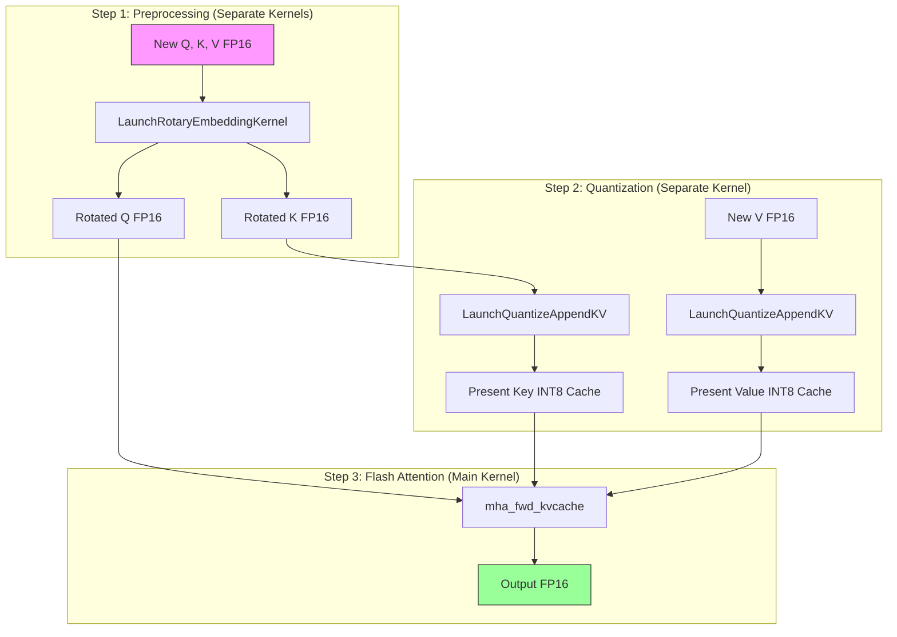

# Gap Analysis: Current vs Optimal INT8 Flash Attention Implementation

## Executive Summary

This document analyzes the gap between the current ONNX Runtime INT8 quantized Flash Attention implementation and the optimal theoretical design described in `FlashAttention_Int8KV.md`.

### Profiling Results (Batch=1, SeqLen=1, PastSeq=2048, 32 Q Heads, 8 KV Heads, HeadDim=128)

| Kernel | Total (ms) | Calls | Avg (μs) | % of Total |
|--------|------------|-------|----------|------------|
| `flash_fwd_int8_dequant_kernel` | 8.226 | 100 | **82.26** | **88.2%** |
| `flash_fwd_splitkv_combine_kernel` | 0.379 | 100 | 3.79 | 4.1% |
| `RotaryEmbeddingBSNH` | 0.403 | 205 | 1.97 | 2.1% |
| `QuantizeAppendKernel` | 0.371 | 205 | 1.81 | 1.9% |
| `UnpackQKV` | 0.172 | 100 | 1.72 | 1.8% |
| `GetSequenceLengths` | 0.127 | 100 | 1.27 | 1.4% |

**Total per decode step: ~93 μs** (Flash Attn kernel dominates at 82 μs + 3.8 μs reduction = 86 μs)

### Key Finding: Flash Attention Kernel is the Bottleneck

```
Theoretical Memory Bandwidth Analysis:
├── KV cache read: 2048 × 8 × 128 × 2 (K+V) × 1 byte = 4 MB
├── A100 HBM Bandwidth: 2039 GB/s
├── Theoretical minimum time: 4 MB / 2039 GB/s ≈ 2 μs
├── Actual kernel time: 82 μs
└── Memory Bandwidth Efficiency: 2/82 = 2.4% ⚠️
```

> [!CAUTION]
> The INT8 Flash Attention kernel achieves only **2.4% of theoretical memory bandwidth**. This is the primary optimization target.

### Memory Layout Status

✅ **Confirmed**: KV cache already uses BNSH format `[batch, num_kv_heads, seq_len, head_dim]`
✅ **Confirmed**: Q uses BSNH format or packed QKV uses `BS(N+2Nk)H` format

---

## Current Implementation Architecture

### Entry Points

| Function | File | Purpose |
|----------|------|---------|
| `FlashAttentionWithQuantizeKV` | `group_query_attention_impl.cu:1207` | Entry for decoding with INT8 KV cache |
| `FlashAttentionAndQuantizeKV` | `group_query_attention_impl.cu:1092` | Entry for first prompt (FP16 attention + quantize KV) |
| `run_flash_int8_dequant_fwd` | `flash_fwd_launch_template.h:338` | Kernel launcher |
| `compute_attn_1rowblock` | `flash_int8_fwd_kernel.h:238` | Core attention kernel |

### Current Data Flow (Decoding Phase)



### Current Kernel Characteristics

From `flash_int8_fwd_kernel.h`:

```cpp
// Kernel Traits (HeadDim=128)
kBlockM = 64;           // Query block size
kBlockN = 64;           // KV block size
kNWarps = 4;            // 4 warps per block
kNThreads = 128;        // 128 threads per block
kSmemRowStrideInt8 = 144;  // Padded stride for bank conflict avoidance
```

**Grid Configuration** (from `run_flash_int8_dequant_fwd`):
```cpp
dim3 grid(num_m_block,
          params.num_splits > 1 ? params.num_splits : params.b,
          params.num_splits > 1 ? params.b * params.h : params.h);
```

For decoding (Q_len=1, batch=1, 32 Q heads):
- `num_m_block = ceil(1/64) = 1`
- `grid = (1, 1, 32)` → **32 blocks**

---

## Key Gaps Identified

> [!IMPORTANT]
> The profiling shows **82 μs** for the main kernel with **2.4% memory bandwidth efficiency**. This is the critical optimization target—overhead kernels (~7 μs total) are minor.

### Gap 1: Extreme Memory Bandwidth Inefficiency (CRITICAL)

**Profiling Data**:
```
KV Cache Size: 2048 × 8 × 128 × 2 = 4 MB
Theoretical Time (A100): 4 MB / 2039 GB/s = 2 μs
Actual Time: 82 μs
Efficiency: 2.4%
```

**Root Cause Analysis**:

> [!NOTE]
> **Correction**: The `gemm_quant_manual` function in `utils.h` (lines 437-460) **already has vectorized dequantization** using `__half2` intrinsics. Dequantization is NOT the bottleneck.

The real bottlenecks are:

1. **Tile Iteration Overhead**: Processing 2048 timesteps with `kBlockN=64` requires 32 iterations of the main loop per block. Each iteration has:
   - `cp.async_fence` + `cp_async_wait<0>` + `__syncthreads()` synchronization
   - Two `gemm_quant_manual` calls (Q×K^T and P×V)
   - Masking, softmax rescaling, accumulation

2. **GQA Inefficiency**: 32 blocks (one per Q head) each load the same KV data independently. With 4:1 GQA ratio, this means 4× redundant KV loads.

3. **Q_len=1 Workload Mismatch**: `kBlockM=64` configured but only 1 Q row active wastes 63/64 of M-dimension resources.

### Gap 2: Sequential Tile Processing with High Sync Overhead

**Current** (from `flash_int8_fwd_kernel.h:501-718`):
```cpp
for (int n_block = n_block_max - 1; n_block >= n_block_min; --n_block) {
    // 1. Load K/V from Global → Smem (INT8)
    flash::copy<...>(gmem_tiled_copy_KInt8, tKgK_int8, tKsK_int8, ...);
    flash::copy<...>(gmem_tiled_copy_KInt8, tVgV_int8, tVsV_int8, ...);

    cute::cp_async_fence();
    cute::cp_async_wait<0>();   // ← Full sync every iteration!
    __syncthreads();

    // 2. Q @ K^T (GEMM with dequant)
    flash::gemm_quant_manual<false>(...);

    // 3. Softmax + Masking
    ...

    // 4. P @ V (GEMM with dequant)
    flash::gemm_quant_manual<false>(...);

    __syncthreads();  // ← Another sync!
}
```

**Analysis**: For 2048 timesteps / 64 = 32 iterations:
- 64 synchronizations total (2 per iteration)
- Each sync stalls the entire block
- No pipelining between tiles

**Optimal**: Double-buffered K/V loading with async barriers to overlap compute and memory.

### Gap 3: GQA Not Fully Exploited

**Current**: Each of the 32 Q heads launches a separate block, loading K/V 4 times per KV head group.

**Profiling Implication**: 32 blocks × 2 MB (shared across 4 blocks via GQA) = 8 MB total reads vs 2 MB optimal.

**Data Amplification**: 4× memory traffic due to not sharing K/V across GQA group.

### Gap 4: kBlockM=64 Wasteful for Decoding

**Current**:
```cpp
kBlockM = 64;  // But Q_len = 1 for decoding!
kBlockN = 64;  // Process 64 timesteps per tile
```

**Issue**: Only 1/64 of the M-dimension resources are used for decoding.

**Optimal**: Specialized decode kernel with `kBlockM=1` or repurpose threads for K-dimension parallelism.

### Gap 5: Separate Kernels (Minor - ~7 μs overhead)

**Profiling Breakdown**:
| Overhead Kernel | Time (μs) | % of Overhead |
|-----------------|-----------|---------------|
| `flash_fwd_splitkv_combine_kernel` | 3.79 | 52% |
| `RotaryEmbeddingBSNH` | 1.97 | 27% |
| `QuantizeAppendKernel` | 1.81 | 25% |
| `UnpackQKV` | 1.72 | 24% |
| `GetSequenceLengths` | 1.27 | 18% |

**Impact**: Total overhead is ~7.2 μs, only 8% of total time. Fusion would help but is not the main issue.

---

## Quantitative Impact Analysis (Profiling-Based)

### Time Breakdown

```
Total Decode Step: 93.3 μs
├── Flash Attention Kernel: 82.3 μs (88.2%)
│   └── Split-K Combine: 3.8 μs (4.1%)
├── RoPE Kernels: 1.97 μs × 2 ≈ 4 μs (4.3%)
├── QuantizeAppend: 1.81 μs × 2 ≈ 3.6 μs (3.9%)
├── UnpackQKV: 1.72 μs (1.8%)
└── GetSequenceLengths: 1.27 μs (1.4%)
```

### Potential Speedup Analysis

| Optimization | Current | Target | Speedup | Effort |
|--------------|---------|--------|---------|--------|
| GQA-aware blocking (4× less reads) | 82 μs | ~20 μs | **4×** | High |
| Double-buffered pipelining | 82 μs | ~40 μs | **2×** | Medium |
| Specialized decode kernel (Q=1) | 82 μs | ~10 μs | **8×** | High |
| Combined optimizations | 82 μs | ~5-10 μs | **8-16×** | Very High |

### Memory Bandwidth Efficiency Target

| Metric | Current | Target | Notes |
|--------|---------|--------|-------|
| Kernel time | 82 μs | 5-10 μs | Approach theoretical minimum |
| Bandwidth efficiency | 2.4% | 50-70% | Realistic achievable |
| Total decode step | 93 μs | 15-20 μs | 5× overall speedup |

---

## Recommended Optimizations (Priority by Impact)

> [!TIP]
> Vectorization is already implemented. Focus on **GQA-aware blocking** and **specialized decode kernel** for the biggest gains.

### Priority 1: GQA-Aware Kernel Design (4× potential)

**Current**: 32 blocks (one per Q head), each loading full KV cache.
**Optimal**: 8 blocks (one per KV head), each computing 4 Q heads with shared K/V.

**Implementation**:
1. Change grid from `(1, splits, 32)` to `(8, splits, 1)`
2. Each block loads K/V once, computes 4 Q heads in parallel via warp specialization
3. Each of 4 warps handles 1 Q head in the GQA group

```cpp
// Modified grid configuration
dim3 grid(num_kv_heads, num_splits, batch_size);  // 8 × splits × 1

// Inside kernel: warp specialization for GQA
const int kv_head = blockIdx.x;
const int warp_id = threadIdx.x / 32;  // 0-3
const int q_head = kv_head * 4 + warp_id;  // Each warp handles different Q head
```

**Expected Impact**: 4× reduction in memory reads → 82 μs / 4 ≈ 20 μs.

### Priority 2: Double-Buffered Pipelining (2× potential)

**Current**: Full sync after each tile load (`cp_async_wait<0>` + `__syncthreads`).
**Optimal**: Overlap K/V load of tile N+1 with compute of tile N.

```cpp
// Pipelined main loop
cute::copy(gmem_copy, gK_tile[0], sK[0]);  // Tile 0 load
cute::copy(gmem_copy, gV_tile[0], sV[0]);
cute::cp_async_fence();

for (int n = 0; n < num_tiles; ++n) {
    // Start loading tile N+1 while computing tile N
    if (n < num_tiles - 1) {
        cute::copy(gmem_copy, gK_tile[n+1], sK[(n+1) % 2]);
        cute::copy(gmem_copy, gV_tile[n+1], sV[(n+1) % 2]);
        cute::cp_async_fence();
    }

    cute::cp_async_wait<1>();  // Wait for tile N to be ready
    __syncthreads();

    // Compute on tile N in sK[n % 2], sV[n % 2]
    gemm_quant_manual(...);
    ...
}
```

**Expected Impact**: Hide ~50% of memory latency → further 2× improvement.

### Priority 3: Specialized Decode Kernel (8× potential)

Create a decode-specific kernel optimized for Q_len=1 that combines GQA awareness with optimal threading:

```cpp
// flash_decode_int8_gqa_kernel.h
template <int kHeadDim, int kNumSplits, int kGQARatio>
__global__ void flash_decode_int8_gqa_kernel(
    const half* Q,           // [batch, num_q_heads, head_dim]
    const int8_t* K,         // [batch, num_kv_heads, seq_len, head_dim] BNSH
    const int8_t* V,         // [batch, num_kv_heads, seq_len, head_dim] BNSH
    half* O,                 // [batch, num_q_heads, head_dim]
    float* LSE_partial,      // For Split-K reduction
    ...
) {
    // Grid: (num_kv_heads, num_splits, batch)
    // Block: 128 threads (4 warps, 1 per Q head in GQA group)

    const int kv_head = blockIdx.x;
    const int split_idx = blockIdx.y;
    const int warp_id = threadIdx.x / 32;
    const int lane_id = threadIdx.x % 32;

    // Each warp: load Q[q_head] to registers (128 elements / 32 lanes = 4 per lane)
    // All warps: share K/V load via collaborative smem copy
    // Each warp: compute attention independently with online softmax
    ...
}
```

### Priority 4: Fuse Overhead Kernels (Minor)

RoPE + Quantize + UnpackQKV total ~7 μs. Fusion could save ~3-4 μs. Low priority.

---

## Implementation Roadmap

### Phase 1: Quick Wins (1-2 days)

1. **Verify BNSH is used**: Add debug logging to confirm memory layout
2. **Measure baseline**: Profile current implementation with NCU
3. **Enable `kEnableOnTheFlyNewKVQuantization`**: Test existing fused path

### Phase 2: Fused Quantization (1 week)

1. Modify `FlashAttentionWithQuantizeKV` to pass raw FP16 K/V
2. Update `mha_fwd_kvcache` API to accept both INT8 cache and FP16 new tokens
3. Implement write-back path in `flash_int8_fwd_kernel.h`

### Phase 3: Specialized Decoding Kernel (2 weeks)

1. Create new `flash_decode_int8_fwd_kernel.h`
2. Implement Split-K with online softmax reduction
3. Add dispatch logic in `run_mha_fwd_dequant_dispatch`

---

## Verification Metrics

After optimizations, measure:

1. **End-to-end latency**: Time per decode step (target: ~1.5 μs)
2. **Memory bandwidth utilization**: NCU `dram__bytes.sum.per_second` (target: >70%)
3. **SM efficiency**: NCU `sm__inst_executed.avg.pct_of_peak_sustained_active` (target: >50%)
4. **Kernel fusion**: Count kernel launches per decode step (target: 1-2)

---

## References

- [FlashAttention_Int8KV.md](file:///home/tlwu/onnxruntime/FlashAttention_Int8KV.md) - Optimal design document
- [flash_int8_fwd_kernel.h](file:///home/tlwu/onnxruntime/onnxruntime/contrib_ops/cuda/bert/flash_attention/flash_int8_fwd_kernel.h) - Current kernel
- [group_query_attention_impl.cu](file:///home/tlwu/onnxruntime/onnxruntime/contrib_ops/cuda/bert/group_query_attention_impl.cu) - Dispatch logic
