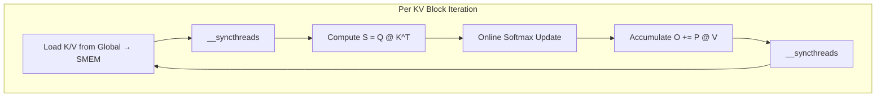

# Flash Attention INT8 Decode Kernel: ONNX Runtime vs XQA Analysis

## Executive Summary

This document compares the ONNX Runtime Flash Attention INT8 KV decode kernel with TensorRT-LLM's XQA (eXtreme Query Attention) kernel to identify optimization opportunities.

| Aspect | ONNX Runtime | TensorRT-LLM XQA |
|--------|--------------|------------------|
| **Primary Use Case** | Decode (Q=1) with INT8 KV | Generation-phase MQA/GQA |
| **Warp Specialization** | ❌ No | ✅ Yes (gemm0/gemm1 warps) |
| **Double Buffering K/V** | ❌ No | ✅ Yes (nbKBuffers=2, nbVBuffers=2) |
| **MBarrier Usage** | ❌ No | ✅ Yes (sophisticated barrier system) |
| **Async Memory Ops** | Limited | ✅ LDGSTS with arrival-tx |
| **GQA-aware Blocking** | ✅ Yes (4 warps/KV head) | ✅ Yes (flexible warp groups) |

---

## 1. ONNX Runtime INT8 Decode Kernel Analysis

### 1.1 Code Structure

| File | Purpose |
|------|---------|
| [flash_fwd_qint8_decode_kernel.h](file:///home/tlwu/git/onnxruntime/onnxruntime/contrib_ops/cuda/bert/flash_attention/flash_fwd_qint8_decode_kernel.h) | Core decode kernel with INT8 dequant |
| [flash_fwd_qint_launch_template.h](file:///home/tlwu/git/onnxruntime/onnxruntime/contrib_ops/cuda/bert/flash_attention/flash_fwd_qint_launch_template.h) | Kernel launcher |
| [group_query_attention_impl.cu](file:///home/tlwu/git/onnxruntime/onnxruntime/contrib_ops/cuda/bert/group_query_attention_impl.cu) | API entry point |

### 1.2 Current Architecture

```cpp
// Kernel Traits
kHeadDim = 128;
kBlockN = 128;      // KV block size per iteration
kNWarps = 4;        // 4 warps for 4 Q heads in GQA group
kNThreads = 128;    // 4 * 32

// Grid Configuration
Grid: (num_kv_heads, num_splits, batch)
Block: 128 threads (4 warps)
```

**Key Optimizations Already Present:**
- ✅ GQA-aware: 1 block per KV head, 4 warps handle 4 Q heads
- ✅ Q=1 specialization: GEMV instead of GEMM
- ✅ Online softmax: Streaming max/sum computation
- ✅ Vectorized INT8 loads: int4 (16 bytes) vectorization
- ✅ Bank conflict avoidance: Padded shared memory stride (128 → 144)

### 1.3 Current Data Flow



### 1.4 Performance Bottlenecks

1. **Sequential Load/Compute**: No overlap between loading next K/V tile and computing current tile
2. **Full Synchronization**: `__syncthreads()` every iteration blocks all warps
3. **Single Buffer Strategy**: Entire block waits for K/V load before computation

---

## 2. TensorRT-LLM XQA Kernel Analysis

### 2.1 Code Structure

| File | Purpose |
|------|---------|
| [mha.cu](file:///home/tlwu/git/tensorrt-llm/cpp/kernels/xqa/mha.cu) | Main XQA kernel for Ampere/Ada |
| [mha_sm90.cu](file:///home/tlwu/git/tensorrt-llm/cpp/kernels/xqa/mha_sm90.cu) | Hopper-specific with TMA |
| [barriers.cuh](file:///home/tlwu/git/tensorrt-llm/cpp/kernels/xqa/barriers.cuh) | MBarrier wrapper classes |
| [mhaUtils.cuh](file:///home/tlwu/git/tensorrt-llm/cpp/kernels/xqa/mhaUtils.cuh) | Memory utilities |

### 2.2 Key Design Patterns

#### 2.2.1 Warp Specialization (Producer/Consumer)

```cpp
// XQA uses 2-way warp specialization
constexpr uint3 ctaShapeInWarps = {4, 1, 2};  // z=2 for warp specialization
// z=0: "gemm0 warps" - compute Q×K
// z=1: "gemm1 warps" - compute softmax(S)×V and prefetch V
```

**Benefits:**
- gemm0 warps compute attention scores while gemm1 warps prefetch V
- gemm1 warps load next iteration's data while gemm0 computes
- Hides memory latency through concurrent execution

#### 2.2.2 Double Buffering

```cpp
// XQA Shared Memory buffers
constexpr uint32_t nbKBuffers = 2;   // Double-buffered K tiles
constexpr uint32_t nbVBuffers = 2;   // Double-buffered V tiles
constexpr uint32_t nbQBuffers = 2;   // Double-buffered Q tiles

struct SharedMem {
    QSmemBuffer q[nbQBuffers];
    KSmemBuffer k[ctaShapeInWarps.x][nbKBuffers];
    VSmemBuffer v[gemm1NbWarpGrps][nbVBuffers];
    // ... barriers and sync structures
};
```

#### 2.2.3 MBarrier-based Fine-Grained Synchronization

```cpp
// Instead of __syncthreads(), XQA uses MBarriers
using CtaBarrier = MBarrier<Scope::CTA>;

// Arrival with transaction count (for async copies)
bar->arrive_tx(txCount);  // "I will complete txCount bytes"

// Wait for producer
bar->wait(token);

// Supports parity-based toggling for double buffering
bar->wait_parity(parity);
```

**Benefits over __syncthreads:**
- Only sync between producer/consumer warps, not entire CTA
- Arrival-TX pattern for async copies with precise byte counting
- Parity-based alternation for double-buffer switching

#### 2.2.4 Barrier Pair Pattern

```cpp
// XQA uses forward/backward barrier pairs
struct CtaBarrierPair {
    CtaBarrier forward;   // Producer signals completion
    CtaBarrier backward;  // Consumer signals buffer can be reused
};

// Producer: arrive forward, wait backward
// Consumer: wait forward, arrive backward
```

---

## 3. Comparison: ONNX Runtime vs XQA

### 3.1 Memory Transfer Approach

| Feature | ONNX Runtime | XQA |
|---------|--------------|-----|
| K/V Load | Vectorized int4 loads | LDGSTS async with cp.async |
| Buffering | Single buffer | Double buffered |
| Sync Mechanism | `__syncthreads()` | MBarrier with arrival-tx |
| Compute/Load Overlap | ❌ None | ✅ Producer/consumer |

### 3.2 Warp Organization

| Feature | ONNX Runtime | XQA |
|---------|--------------|-----|
| Warps per Block | 4 (1 per Q head) | 8 (4 gemm0 + 4 gemm1) |
| Warp Specialization | ❌ No | ✅ Yes |
| GQA K/V Sharing | ✅ Shared SMEM load | ✅ + Warp group coordination |

### 3.3 Synchronization

| Feature | ONNX Runtime | XQA |
|---------|--------------|-----|
| Main Sync | `__syncthreads()` | MBarrier |
| Barrier Granularity | Whole CTA | Per warp-group |
| Double-buffer Toggle | ❌ N/A | Parity-based |

---

## 4. Optimization Opportunities for ONNX Runtime

### Priority 1: Double-Buffered K/V Loading (HIGH IMPACT)

**Current Issue:** All warps wait for K/V load before compute.

**XQA Solution:** Double-buffered K/V with producer/consumer pattern.

**Implementation:**

```cpp
// Proposed shared memory layout
static constexpr int kNumStages = 2;  // Double buffer
struct SharedStorage {
    float sQ[kNWarps][kHeadDim];
    ElementInt8 sK[kNumStages][kBlockN][kSmemRowStrideInt8];
    ElementInt8 sV[kNumStages][kBlockN][kSmemRowStrideInt8];
};

// Main loop with pipelining
int buf_idx = 0;
// Prologue: start loading first tile
load_kv_async(k_ptr, v_ptr, sK[0], sV[0], 0);

for (int n_block = 0; n_block < n_blocks; ++n_block) {
    // Start loading next tile to alternate buffer
    if (n_block + 1 < n_blocks) {
        load_kv_async(k_ptr, v_ptr, sK[1-buf_idx], sV[1-buf_idx], n_block+1);
    }
    
    // Wait for current tile in sK[buf_idx], sV[buf_idx]
    cp_async_wait<1>();  // Wait for N-1 outstanding
    __syncthreads();
    
    // Compute on current tile
    compute_scores(sQ, sK[buf_idx], scores);
    online_softmax_update(scores, m_i, l_i, acc_o, sV[buf_idx]);
    
    buf_idx = 1 - buf_idx;  // Toggle
}
```

**Expected Improvement:** 30-50% reduction in memory latency visible time.

---

### Priority 2: Warp Specialization (MEDIUM-HIGH IMPACT)

**Current Issue:** All 4 warps do the same work (compute + wait for load).

**XQA Solution:** Split warps into gemm0 (Q×K) and gemm1 (softmax×V + prefetch).

**Implementation Approach:**

```cpp
// Use 8 warps: 4 for gemm0, 4 for gemm1
constexpr int kNWarps = 8;   // Increase from 4
constexpr int kNThreads = 256;

// Warp role assignment
const int warp_role = warp_id / 4;  // 0=gemm0, 1=gemm1
const int warp_idx_in_role = warp_id % 4;

// MBarrier-based synchronization
__shared__ uint64_t barriers[2];  // Forward/backward

if (warp_role == 0) {
    // GEMM0 warps: Compute Q×K, produce scores
    compute_qk_scores(...);
    mbarrier_arrive(barriers[0]);  // Signal scores ready
    mbarrier_wait(barriers[1]);    // Wait for gemm1 to release
} else {
    // GEMM1 warps: Load next V, compute softmax×V
    load_next_v_async(...);
    mbarrier_wait(barriers[0]);    // Wait for scores
    compute_softmax_v(...);
    mbarrier_arrive(barriers[1]);  // Signal buffer released
}
```

**Expected Improvement:** 20-40% by overlapping Q×K compute with V prefetch.

---

### Priority 3: Fine-Grained MBarrier Synchronization (MEDIUM IMPACT)

**Current Issue:** `__syncthreads()` blocks all 128 threads.

**XQA Solution:** MBarrier with arrival-tx for precise producer/consumer sync.

**Implementation:**

```cpp
// Replace __syncthreads with MBarrier
#if __CUDA_ARCH__ >= 800
#include <cuda/barrier>

__shared__ cuda::barrier<cuda::thread_scope_block> kv_barrier;

// Producer side (loading warps)
if (tidx == 0) {
    init(&kv_barrier, expected_arrivals);
}
__syncthreads();

// During K/V load
kv_barrier.arrive_and_wait();  // Only syncs relevant threads

// With async copy
kv_barrier.arrive_tx(bytes_loaded);  // Precise byte tracking
#endif
```

---

### Priority 4: Tile Size Optimization (LOW-MEDIUM IMPACT)

**Current Issue:** kBlockN=128 may not be optimal for all sequence lengths.

**XQA Solution:** Adaptive tile sizing based on sequence length and cache.

**Analysis:**

| Metric | kBlockN=64 | kBlockN=128 |
|--------|------------|-------------|
| SMEM per iter | 8KB K + 8KB V | 16KB K + 16KB V |
| Iterations (seq=2048) | 32 | 16 |
| Loop overhead | Higher | Lower |
| Occupancy | Higher | Lower |

**Recommendation:** Keep kBlockN=128 for long sequences, add kBlockN=64 variant for shorter sequences.

---

### Priority 5: Paged KV Cache Support (FEATURE ADDITION)

**XQA Feature:** Native support for VLLM-style paged KV cache.

```cpp
// XQA paged KV cache structure
template <typename Head, uint32_t tokensPerPage, uint32_t nbPages>
struct HeadPtr {
    Head* pool;
    Vec<KVCachePageIndex, nbPages> pageIndices;
    uint32_t offset;
    
    __device__ Head& operator[](uint32_t i) const {
        uint32_t page_idx = pageIndices[i / tokensPerPage];
        uint32_t token_in_page = i % tokensPerPage;
        return pool[page_idx * tokensPerPage + token_in_page];
    }
};
```

---

## 5. Implementation Roadmap

### Phase 1: Double Buffering (1-2 weeks)

| Step | Description | Effort |
|------|-------------|--------|
| 1.1 | Modify SharedStorage for 2-stage K/V buffers | 2 days |
| 1.2 | Add cp.async prologue/epilogue for pipelining | 3 days |
| 1.3 | Implement buffer toggle logic | 2 days |
| 1.4 | Benchmark and tune | 3 days |

**Files to Modify:**
- [flash_fwd_qint8_decode_kernel.h](file:///home/tlwu/git/onnxruntime/onnxruntime/contrib_ops/cuda/bert/flash_attention/flash_fwd_qint8_decode_kernel.h)

### Phase 2: MBarrier Integration (1 week)

| Step | Description | Effort |
|------|-------------|--------|
| 2.1 | Add MBarrier wrapper (similar to XQA barriers.cuh) | 2 days |
| 2.2 | Replace key __syncthreads with MBarrier | 2 days |
| 2.3 | Tune arrival patterns | 1 day |

### Phase 3: Warp Specialization (2-3 weeks)

| Step | Description | Effort |
|------|-------------|--------|
| 3.1 | Design 8-warp kernel with role assignment | 3 days |
| 3.2 | Implement gemm0/gemm1 split | 5 days |
| 3.3 | Add inter-warp synchronization | 3 days |
| 3.4 | Optimize register allocation | 4 days |

### Phase 4: Advanced Features (Optional)

| Feature | Effort | Impact |
|---------|--------|--------|
| Paged KV Cache | 1 week | Feature parity |
| Beam Search Support | 3 days | Inference feature |
| SM90 TMA Path | 2 weeks | Hopper optimization |

---

## 6. Verification Plan

### Unit Tests

```bash
# Run existing ONNX Runtime GQA tests
cd /home/tlwu/git/onnxruntime/build
./onnxruntime_pybind11_state_tests --gtest_filter="*GroupQueryAttention*"
```

### Performance Benchmarks

```python
# Python benchmark script
import onnxruntime as ort
import numpy as np
import time

# Benchmark configurations
configs = [
    {"batch": 1, "seq_len": 2048, "q_heads": 32, "kv_heads": 8, "head_dim": 128},
    {"batch": 4, "seq_len": 4096, "q_heads": 32, "kv_heads": 8, "head_dim": 128},
]

for cfg in configs:
    # Run benchmark
    times = []
    for _ in range(100):
        start = time.perf_counter()
        # Execute GQA with INT8 KV cache
        end = time.perf_counter()
        times.append(end - start)
    
    print(f"Config: {cfg}")
    print(f"  Mean: {np.mean(times)*1000:.3f} ms")
    print(f"  P50:  {np.percentile(times, 50)*1000:.3f} ms")
```

### NCU Profiling

```bash
# Profile memory bandwidth efficiency
ncu --set full \
    --target-processes all \
    ./onnxruntime_perf_test \
    -m /path/to/model.onnx \
    -r runs

# Key metrics to check:
# - dram__bytes.sum.per_second (target: >70% of peak)
# - sm__inst_executed.avg.pct_of_peak_sustained_active (target: >50%)
# - sm__cycles_elapsed.avg (compare before/after)
```

---

## 7. Risk Assessment

| Risk | Mitigation |
|------|------------|
| Register pressure increase | Profile occupancy, tune kBlockN if needed |
| SMEM increase for double-buffer | Stay within 96KB limit, or use L2 cache hints |
| MBarrier availability | Fallback to __syncthreads for SM < 80 |
| Compile time bloat | Use template dispatch sparingly |

---

## 8. References

- [FlashAttention_Int8KV.md](file:///home/tlwu/git/onnxruntime/FlashAttention_Int8KV.md) - Original design document
- [FlashAttention_Int8KV_Gap_Analysis.md](file:///home/tlwu/git/onnxruntime/FlashAttention_Int8KV_Gap_Analysis.md) - Performance gap analysis
- [XQA README.md](file:///home/tlwu/git/tensorrt-llm/cpp/kernels/xqa/README.md) - XQA overview
- [TensorRT-LLM barriers.cuh](file:///home/tlwu/git/tensorrt-llm/cpp/kernels/xqa/barriers.cuh) - MBarrier implementation
