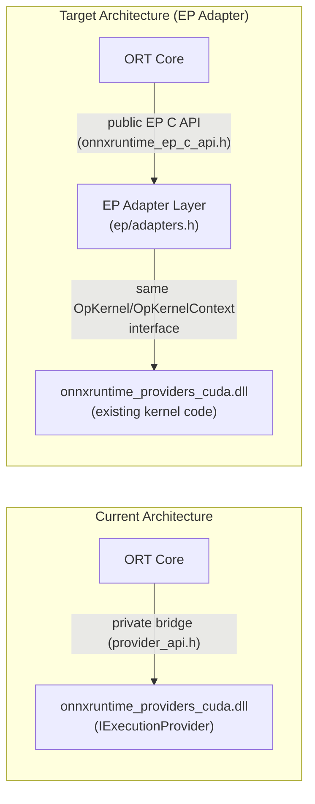
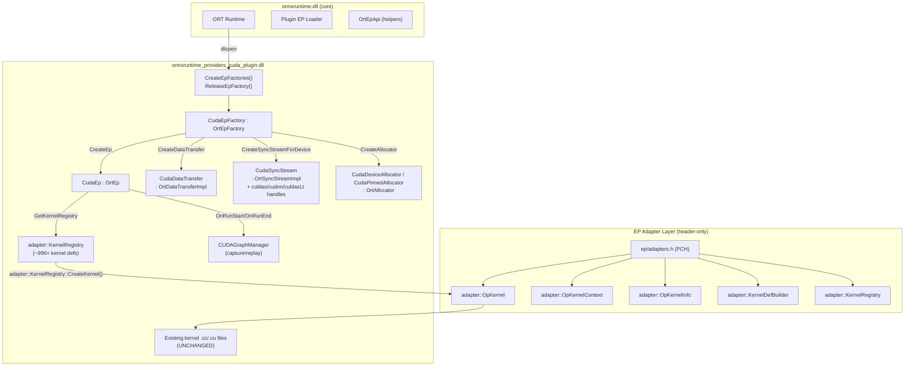
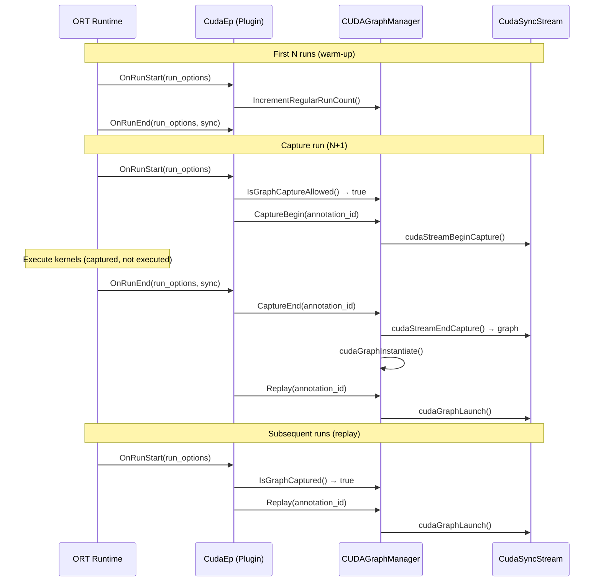
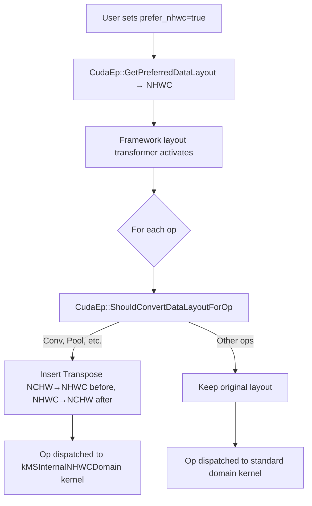

# CUDA EP Plugin Migration — Design & Task Breakdown

## 1. Executive Summary

Migrate the CUDA Execution Provider from an internally-linked EP to a **Plugin EP** using the public [onnxruntime_ep_c_api.h](include/onnxruntime/core/session/onnxruntime_ep_c_api.h) interface and the **EP Adapter framework** ([include/onnxruntime/ep/](include/onnxruntime/ep/)).

### Key Principles

1. **EP Adapter approach** — Use the EP Adapter headers (`include/onnxruntime/ep/adapter/`) to bridge existing kernel-based EP code to the plugin EP API with minimal changes. The adapter framework provides facade classes (`OpKernel`, `OpKernelContext`, `OpKernelInfo`, `KernelDefBuilder`, `KernelRegistry`) that preserve the internal ORT interface while routing through the public EP C API.
2. **Incremental migration** — Always keep the EP buildable and testable with existing CI. Un-ported parts continue using internal headers until migrated.
3. **Preserve kernel interface** — Kernel source files (`.cc`/`.cu`) require **zero or near-zero changes** — the adapter headers redefine registration macros and type aliases so existing code compiles unmodified.
4. **CUDA Graph integration** — Implement CUDA Graph capture/replay via `OrtEp::OnRunStart`/`OnRunEnd` + `CUDAGraphManager` stored in the plugin EP.
5. **NHWC layout transformation** — Implement via `GetPreferredDataLayout` + `ShouldConvertDataLayoutForOp` OrtEp callbacks, replacing the internal `GetPreferredLayout()` and `ShouldConvertDataLayoutForOp()` overrides.
6. **Out of scope** — NCCL/multi-GPU, training-specific features.

### Current State: Shared Library Bridge

> [!IMPORTANT]
> The CUDA EP is **already** a shared library (`onnxruntime_providers_cuda.dll/so`), but it uses a **private bridge API** ([provider_api.h](onnxruntime/core/providers/shared_library/provider_api.h) → `ProviderHost_impl.h`) rather than the public EP C API. The migration replaces this private bridge with the public plugin EP interface.



### EP Adapter Framework

The EP Adapter framework (commit `72a4cd7025`) provides header-only adapter classes in `include/onnxruntime/ep/adapter/` that allow existing kernel-based EPs to use the plugin EP API while keeping minimal changes to existing code:

| Adapter Class | Wraps | Purpose |
|---|---|---|
| `ep::adapter::OpKernel` | `OrtKernelImpl` | Base class for kernels; preserves `Compute()` signature |
| `ep::adapter::OpKernelContext` | `OrtKernelContext` | Input/output tensor access via familiar API |
| `ep::adapter::OpKernelInfo` | `OrtKernelInfo` | Attribute access, constant input caching |
| `ep::adapter::KernelDefBuilder` | `OrtKernelDefBuilder` | Kernel definition with same fluent API |
| `ep::adapter::KernelRegistry` | `OrtKernelRegistry` | Registration with same `Register(KernelCreateInfo)` pattern |
| `ep::adapter::Ep` | `OrtEp` | Wraps `IExecutionProvider` for hybrid migration |
| `ep::adapter::DataTransferManager` | `OrtDataTransferImpl` | Data copy abstraction |
| `ep::adapter::Logger` | `OrtLogger` | Logging adapter |

The key insight: include `ep/adapters.h` as a pre-compiled header (PCH), and the `using` declarations in `EP_SPECIFIC_USING_DECLARATIONS` remap `onnxruntime::cuda::OpKernel`, `KernelDefBuilder`, etc. to their adapter equivalents. Existing kernel `.cc` files compile **without modification**.

### Scope

| Item | Size | Notes |
|------|------|-------|
| Standard op kernels | ~996 registrations | **Zero kernel code changes** via EP adapter macros |
| Contrib op kernels | ~10+ domains, ~414 bert files | Same approach |
| Stream/Data Transfer | ~5 files | `CudaSyncStream`/`CudaDataTransfer` (already prototyped) |
| Allocators | ~3 files | `CudaDeviceAllocator`/`CudaPinnedAllocator` (already prototyped) |
| Provider factory | ~2 files | `CudaEpFactory`/`CudaEp` (already prototyped) |
| CUDA Graph | ~4 files | `OnRunStart`/`OnRunEnd` + `CUDAGraphManager` integration |
| NHWC transformation | ~2 files | `GetPreferredDataLayout` + `ShouldConvertDataLayoutForOp` |
| cuBLAS/cuDNN handles | Per-stream | Attached to `CudaSyncStream` (already prototyped) |

---

## 2. Architecture

### 2.1 Target Plugin EP Structure



### 2.2 Kernel Registration: EP Adapter Approach

With the EP Adapter framework, kernel registration uses **the same macros and patterns** as the existing code. The adapter header redefines the internal types so they route through the plugin EP API:

```cpp
// In ep/adapters.h — these using declarations remap types
namespace onnxruntime {
namespace cuda {
EP_SPECIFIC_USING_DECLARATIONS   // KernelDefBuilder, KernelRegistry, OpKernel, etc.
}
}

// Existing kernel registration code compiles UNCHANGED:
ONNX_OPERATOR_TYPED_KERNEL_EX(
    Relu, kOnnxDomain, 14, float, kCudaExecutionProvider,
    (*KernelDefBuilder::Create())              // → adapter::KernelDefBuilder
        .TypeConstraint("T", DataTypeImpl::AllIEEEFloatTensorTypes()),
    Relu<float>);

// The adapter's KernelDefBuilder translates to OrtKernelDefBuilder calls.
// The adapter's KernelRegistry::Register() calls ep_api.KernelRegistry_AddKernel().
```

Under the hood, `adapter::KernelRegistry::CreateKernel()` creates an `adapter::KernelImpl` that wraps the existing `OpKernel` subclass and bridges `Compute()` calls through `OrtKernelContext`.

### 2.3 Kernel Interface Preservation via EP Adapter

The adapter classes in `ep/adapter/op_kernel.h` and `ep/adapter/op_kernel_info.h` provide the same interface kernels expect:

```cpp
// adapter::OpKernel — same interface as onnxruntime::OpKernel
struct OpKernel {
  explicit OpKernel(const OpKernelInfo& info);
  virtual Status Compute(OpKernelContext* context) const = 0;
  const OpKernelInfo& Info() const;
  Node Node() const;
};

// adapter::OpKernelInfo — same GetAttr/GetAttrs interface
struct OpKernelInfo {
  template <typename T> Status GetAttr(const std::string& name, T* value) const;
  template <typename T> Status GetAttrs(const std::string& name, std::vector<T>& values) const;
  const IExecutionProvider* GetExecutionProvider() const;  // via adapter::Ep
  const DataTransferManager& GetDataTransferManager() const;
  // Constant input caching via KernelInfoCache
};

// adapter::OpKernelContext — same Input/Output<Tensor> interface
struct OpKernelContext {
  template <typename T> const T* Input(int index) const;
  template <typename T> T* Output(int index, const TensorShape& shape);
  int InputCount() const;
  int OutputCount() const;
};
```

For CUDA-specific functionality (stream handles, cuBLAS, cuDNN), the `CudaKernel` base class adapter additionally provides:

| Method | Adapter Implementation |
|--------|----------------------|
| `Stream(ctx)` | `CudaSyncStream::GetCudaStream()` via stream lookup |
| `GetCublasHandle(ctx)` | `CudaSyncStream::GetCublasHandle()` |
| `GetCudnnHandle(ctx)` | `CudaSyncStream::GetCudnnHandle()` |
| `GetCublasLtHandle(ctx)` | `CudaSyncStream::GetCublasLtHandle()` |
| `GetScratchBuffer<T>(n)` | `OrtAllocator` → `cudaMalloc` |
| `GetDeviceProp()` | `CUDAExecutionProvider` shim → `cudaGetDeviceProperties` |
| `UseTF32()` | `CudaKernelAdapterRuntimeConfig::use_tf32` (atomic) |
| `AddDeferredReleaseCPUPtr` | `CudaSyncStream::EnqueueDeferredCPUBuffer` |

### 2.4 CUDA Graph Integration

CUDA Graph capture/replay is implemented in the plugin EP via the existing `OnRunStart`/`OnRunEnd` callbacks on `OrtEp`. No new public API is needed.

#### Architecture



#### Implementation Details

| Component | Details |
|-----------|---------|
| **`CUDAGraphManager`** | Reuse existing class from [cuda_graph.h](onnxruntime/core/providers/cuda/cuda_graph.h). Stores `cudaGraphExec_t` per annotation ID. Manages capture/end/replay lifecycle. |
| **`CudaEp::OnRunStart`** | Read `enable_cuda_graph` and `cuda_graph_annotation_id` from `OrtRunOptions`. If graph capture is enabled and not yet captured, call `CaptureBegin()`. If already captured, call `Replay()`. |
| **`CudaEp::OnRunEnd`** | If capturing, call `CaptureEnd()` then `Replay()` (first run after capture needs actual execution). Handle `sync_stream` flag. |
| **Annotation IDs** | Read from `OrtRunOptions` config entries, supporting multiple CUDA graphs per session (e.g., different sequence lengths). |
| **Stream association** | `CUDAGraphManager` holds a reference to the `cudaStream_t` from `CudaSyncStream`. Capture operates on the compute stream. |
| **Memory constraints** | During graph capture, GPU memory addresses must remain stable. The allocator must not free/reallocate between capture and replay. |

#### OrtRunOptions Config Keys

| Key | Type | Description |
|-----|------|-------------|
| `ep.cuda.enable_cuda_graph` | bool | Enable CUDA graph capture for this run |
| `ep.cuda.cuda_graph_annotation_id` | int | Annotation ID for multi-graph support |
| `ep.cuda.min_num_runs_before_cuda_graph_capture` | int | Warm-up runs before capture (default: 1) |

### 2.5 NHWC Graph Transformation Integration

The ORT framework applies NHWC layout transformation **before** kernel execution based on the EP's preferred layout. The plugin EP integrates via two `OrtEp` callbacks:

#### `GetPreferredDataLayout`

Returns `OrtEpDataLayout_NHWC` when the `prefer_nhwc` config is set. The framework's `graph_partitioner.cc` checks this and triggers the layout transformer to insert Transpose nodes around ops that support NHWC.

```cpp
// In CudaEp (already implemented in prototype)
static OrtStatus* ORT_API_CALL GetPreferredDataLayoutImpl(
    OrtEp* this_ptr, OrtEpDataLayout* preferred_data_layout) noexcept {
  const auto* ep = static_cast<const CudaEp*>(this_ptr);
  *preferred_data_layout = ep->config_.prefer_nhwc
      ? OrtEpDataLayout_NHWC : OrtEpDataLayout_NCHW;
  return nullptr;
}
```

#### `ShouldConvertDataLayoutForOp`

Controls which ops get NHWC layout conversion on a per-op basis. Returns `>0` (convert), `0` (don't convert), or `<0` (let ORT decide). This replaces the internal `CUDAExecutionProvider::ShouldConvertDataLayoutForOp()` override.

```cpp
// New implementation needed in CudaEp
static OrtStatus* ORT_API_CALL ShouldConvertDataLayoutForOpImpl(
    OrtEp* this_ptr, const char* domain, const char* op_type,
    OrtEpDataLayout target_data_layout, int* should_convert) noexcept {
  if (target_data_layout != OrtEpDataLayout_NHWC) {
    *should_convert = -1;  // Let ORT decide
    return nullptr;
  }

  // Same op set as existing CUDAExecutionProvider::ShouldConvertDataLayoutForOp
  static const std::unordered_set<std::string_view> cuda_nhwc_onnx_ops{
      "BatchNormalization", "Conv", "ConvTranspose", "GlobalMaxPool",
      "MaxPool", "GlobalAveragePool", "AveragePool", "GridSample",
      "DepthToSpace", "SpaceToDepth", "LRN",
  };

  std::string_view dom{domain}, op{op_type};
  if ((dom == "" && cuda_nhwc_onnx_ops.count(op)) ||
      (dom == "com.microsoft" && op == "GridSample")) {
    *should_convert = 1;
  } else {
    *should_convert = -1;
  }
  return nullptr;
}
```

#### NHWC Kernel Registration

NHWC kernels are registered under `kMSInternalNHWCDomain` in the existing code ([cuda_nhwc_kernels.cc](onnxruntime/core/providers/cuda/cuda_nhwc_kernels.cc)). In the plugin EP:
- The same kernel classes are used (they compile unchanged via EP adapter)
- The same domain registration is needed in the plugin's `KernelRegistry`
- The adapter's `KernelDefBuilder` routes the domain through `OrtKernelDefBuilder::SetDomain()`

#### Integration Flow



---

## 3. Incremental Migration Stages

> [!TIP]
> Each stage produces a buildable, testable EP. The EP Adapter framework enables near-zero changes to kernel source files. CI runs at every stage.

### Stage 1: Plugin Shell & Infrastructure (~2 weeks)

**Goal**: EP loads via plugin API, creates streams/allocators, runs Memcpy + simple ops.

> [!NOTE]
> Most items in this stage are **already prototyped** in commit `31a6e1d2b9`. The work is to clean up, integrate with EP Adapter headers from `72a4cd7025`, and validate.

| # | Work Item | Status | Details |
|---|-----------|--------|---------|
| 1.1 | DLL entry points | ✅ Done | `CreateEpFactories()`, `ReleaseEpFactory()`, symbol exports ([cuda_plugin_ep_symbols.def](onnxruntime/core/providers/cuda/plugin/cuda_plugin_ep_symbols.def)) |
| 1.2 | `CudaEpFactory : OrtEpFactory` | ✅ Done | `GetName/Vendor/Version`, `GetSupportedDevices` (CUDA device enumeration via PCI vendor ID 0x10DE), `CreateEp`, `ReleaseEp`, `IsStreamAware` → true, `CreateAllocator`, `CreateDataTransfer`, `CreateSyncStreamForDevice` |
| 1.3 | `CudaEp : OrtEp` | ✅ Done | `GetName`, `GetCapability`, `GetKernelRegistry`, `OnRunStart`/`OnRunEnd` (stubs), `GetPreferredDataLayout` |
| 1.4 | `CudaDeviceAllocator` / `CudaPinnedAllocator` | ✅ Done | Device allocator (`cudaMalloc`/`cudaFree`), pinned allocator (`cudaHostAlloc`/`cudaFreeHost`) |
| 1.5 | `CudaDataTransfer : OrtDataTransferImpl` | ✅ Done | `CanCopy`, `CopyTensors` — ported from `GPUDataTransfer` |
| 1.6 | `CudaSyncStream : OrtSyncStreamImpl` | ✅ Done | `GetHandle`, `Flush`, `CreateNotification`, `OnSessionRunEnd`. Owns cuBLAS/cuDNN/cuBLASLt handles. Includes deferred CPU buffer cleanup. |
| 1.7 | `CudaSyncNotification : OrtSyncNotificationImpl` | ✅ Done | `Activate`, `WaitOnDevice`, `WaitOnHost` via CUDA events |
| 1.8 | Provider options | ✅ Done | Parse from `OrtSessionOptions` config entries (`ep.cuda.*` prefix takes precedence) |
| 1.9 | CMake integration | ✅ Done | `cmake/onnxruntime_providers_cuda_plugin.cmake` with `ORT_CUDA_PLUGIN_USE_ADAPTER` flag |
| 1.10 | EP Adapter PCH integration | 🔲 TODO | Replace custom `cuda_kernel_adapter.h` with `ep/adapters.h` as PCH. Remove `PluginRegistry` and `AdapterKernelImpl` — use `adapter::KernelRegistry` and `adapter::KernelImpl` instead. |
| 1.11 | Validate | 🔲 TODO | Run basic ops (Memcpy, Relu, Add, MatMul) through plugin EP. CI green. |

---

### Stage 2: Kernel Registration Migration (~1 week)

**Goal**: All existing CUDA kernel registrations work through the EP adapter's `KernelRegistry`.

| # | Work Item | Details |
|---|-----------|---------|
| 2.1 | Standard op registrations | Existing `ONNX_OPERATOR_*_KERNEL_EX` macros compile unchanged — the adapter's `KernelDefBuilder` and `BuildKernelCreateInfo` handle translation. The `cuda_execution_provider.cc` registration table feeds into `adapter::KernelRegistry::Register()`. |
| 2.2 | NHWC registrations | Port [cuda_nhwc_kernels.cc](onnxruntime/core/providers/cuda/cuda_nhwc_kernels.cc) — same macros, `kMSInternalNHWCDomain` domain registration via adapter. |
| 2.3 | Contrib op registrations | Port [cuda_contrib_kernels.cc](onnxruntime/contrib_ops/cuda/cuda_contrib_kernels.cc) — register `com.microsoft` domain ops via adapter. |
| 2.4 | Resolve excluded ops | Handle ops currently excluded from plugin build (see CMake filters): control flow (`If`/`Loop`/`Scan` — use `OrtEpApi::CreateIfKernel`/`CreateLoopKernel`/`CreateScanKernel`), RNN ops, Einsum, object detection, etc. |
| 2.5 | Validate | All kernels register correctly. CI green with plugin mode. |

**Key insight**: The EP adapter's `KernelRegistry` class has `Register(KernelCreateInfo&&)` which internally calls `OrtKernelRegistry::AddKernel()`. The `KernelCreateInfo` is constructed by the same `BuildKernelCreateInfo<>()` template specializations that the existing macros generate. **No script is needed** — the macros produce compatible output.

---

### Stage 3: NHWC & GetCapability Integration (~1 weeks)

**Goal**: NHWC layout transformation and CPU-preferred-node logic work correctly.

| # | Work Item | Details |
|---|-----------|---------|
| 3.1 | `ShouldConvertDataLayoutForOp` | Implement callback on `CudaEp` — same op list as `CUDAExecutionProvider::ShouldConvertDataLayoutForOp()`. |
| 3.2 | `GetCapability` with CPU-preferred nodes | Integrate `GetCpuPreferredNodes` logic from [get_capability_utils.h](include/onnxruntime/ep/get_capability_utils.h) in `CudaEp::GetCapabilityImpl()`. Use `ep_api.EpGraphSupportInfo_LookUpKernel()` + `EpGraphSupportInfo_AddSingleNode()`. |
| 3.3 | NHWC kernel validation | Test Conv, BatchNorm, Pool ops with `prefer_nhwc=true` end-to-end. |
| 3.4 | Validate | ResNet, EfficientNet models with NHWC enabled pass correctness tests. |

---

### Stage 4: CUDA Graph Integration (~2 weeks)

**Goal**: Full CUDA Graph capture/replay via plugin EP.

| # | Work Item | Details |
|---|-----------|---------|
| 4.1 | Port `CUDAGraphManager` | Copy/adapt [cuda_graph.h](onnxruntime/core/providers/cuda/cuda_graph.h)/[cuda_graph.cc](onnxruntime/core/providers/cuda/cuda_graph.cc) into the plugin. Remove dependencies on internal EP types. |
| 4.2 | `OnRunStart` implementation | Parse `enable_cuda_graph`/`cuda_graph_annotation_id` from `OrtRunOptions`. Manage capture/replay state machine. |
| 4.3 | `OnRunEnd` implementation | End capture, replay first run, handle `sync_stream`. Clear deferred CPU buffers only when not capturing. |
| 4.4 | `SetDynamicOptions` | Support `enable_cuda_graph` toggle at runtime. |
| 4.5 | Memory stability | Ensure allocator doesn't free/reallocate during graph capture. May need arena-mode allocator. |
| 4.6 | Validate | CUDA graph capture/replay with BERT, GPT-2 type models. Multi-annotation support. |

---

### Stage 5: Remove Private Bridge & Excluded Ops (~2 weeks)

**Goal**: Sever all [provider_api.h](onnxruntime/core/providers/shared_library/provider_api.h) / `ProviderHost_impl.h` dependencies. Bring excluded ops into plugin.

| # | Work Item | Details |
|---|-----------|---------|
| 5.1 | Control flow ops | `If`, `Loop`, `Scan` — implement `CreateControlFlowKernelImpl()` override using `OrtEpApi::CreateIfKernel`/`CreateLoopKernel`/`CreateScanKernel`. |
| 5.2 | RNN ops | Requires `CudaStream` (not `CudaSyncStream`) for cuDNN RNN API. Either adapt or create thin shim. |
| 5.3 | Tunable ops | Port or stub tunable op infrastructure. May defer if public API gap exists. |
| 5.4 | Einsum | Resolve `cuda_execution_provider.h` dependency. Factor out the compute logic. |
| 5.5 | Audit remaining internal includes | Grep for `provider_api.h`, `ProviderHost_impl.h` usage. Create hit list. |
| 5.6 | Remove `ProviderHost_impl.h` bridge for CUDA | Remove CUDA entries from the provider host bridge |
| 5.7 | Validate | Full CI suite with plugin-only CUDA EP. Standalone DLL compiles with no internal header includes. |

---

### Stage 6: Advanced Features & Polish (~2 weeks)

**Goal**: Profiling, perf validation, packaging.

| # | Work Item | Details |
|---|-----------|---------|
| 6.1 | NVTX profiling | Use NVTX directly (no internal profiler API needed) |
| 6.2 | External resource import | `OrtExternalResourceImporterImpl` for CUDA memory/semaphore import |
| 6.3 | Performance regression testing | Benchmark plugin vs static-link across model zoo |
| 6.4 | Python packaging | `onnxruntime-gpu` pip package includes plugin DLL |
| 6.5 | CI pipeline | Dedicated CI jobs for plugin mode |
| 6.6 | Documentation | API migration guide for third-party CUDA kernels |

---

## 4. Kernel Registration: EP Adapter vs. Script Approach

The original plan called for a migration script to convert `ONNX_OPERATOR_KERNEL_EX` macros. With the EP Adapter framework, **no script is needed**:

### How It Works

1. The `ep/adapters.h` PCH is force-included via compiler flag (`-include ep/adapters.h`)
2. `EP_SPECIFIC_USING_DECLARATIONS` remaps `KernelDefBuilder`, `KernelRegistry`, `KernelCreateInfo`, `OpKernel`, `OpKernelInfo`, `OpKernelContext` in `onnxruntime::cuda` and `onnxruntime::contrib::cuda` namespaces
3. Existing macros like `ONNX_OPERATOR_TYPED_KERNEL_EX(Relu, ...)` produce `adapter::KernelCreateInfo` with an `adapter::KernelDef`
4. The registration code calls `adapter::KernelRegistry::Register(KernelCreateInfo&&)` which internally uses `OrtKernelRegistry_AddKernel()`
5. At kernel creation time, `adapter::KernelRegistry::CreateKernel()` wraps the `OpKernel` subclass in a `KernelImpl : OrtKernelImpl` that bridges `Compute()` calls

### Comparison

| Aspect | Script Approach (old plan) | EP Adapter Approach (current) |
|--------|---------------------------|-------------------------------|
| Kernel source changes | Near-zero | **Zero** |
| Registration code changes | Generated new code | **None** — same macros work |
| Maintenance burden | Generated code must be regenerated on changes | **None** — uses existing macros |
| Type constraint handling | Must parse and regenerate | **Automatic** — `adapter::KernelDefBuilder::TypeConstraint()` calls `MLDataTypeToOrtDataType()` |
| Control flow kernels | Custom | Built-in via `CreateControlFlowKernelImpl()` |

---

## 5. Key Technical Challenges

### 5.1 CudaKernel Base Class Adapter

The `CudaKernel` base class needs a plugin-compatible implementation. The prototype in commit `31a6e1d2b9` demonstrates two approaches:

**Approach A (current prototype)**: `cuda_kernel_adapter.h` as force-included header provides a `CUDAExecutionProvider` shim class and runtime config via atomics. Kernels call `UseTF32()`, `GetDeviceProp()`, etc. through the shim.

**Approach B (target)**: Use `ep/adapter/op_kernel.h` as the base `OpKernel`, and provide a CUDA-specific `CudaKernel` adapter that extends it with stream/handle accessors. The `IExecutionProvider*` from `OpKernelInfo::GetExecutionProvider()` returns the real `CUDAExecutionProvider` shim via `adapter::Ep::EpImpl()`.

The runtime config pattern from the prototype (atomics for `use_tf32`, `device_id`, etc.) works well and should be preserved.

### 5.2 `GetCpuPreferredNodes` → `GetCapability` Integration

The EP Adapter framework provides [get_capability_utils.h](include/onnxruntime/ep/get_capability_utils.h) with a ready-to-use `GetCpuPreferredNodes()` implementation that operates on the `OrtGraph`/`OrtNode` API. The plugin EP's `GetCapability` should:

1. Iterate all graph nodes via `Ort::ConstGraph::GetNodes()`
2. For each node, call `ep_api.EpGraphSupportInfo_LookUpKernel()` to check if a kernel exists
3. Call `GetCpuPreferredNodes()` from the utility to identify nodes that should stay on CPU
4. Add supported nodes via `ep_api.EpGraphSupportInfo_AddSingleNode()`

### 5.3 Excluded Ops in Plugin Build

The prototype CMake file excludes several op categories. Strategy for each:

| Category | Why Excluded | Resolution |
|----------|-------------|-----------|
| Control flow (`If`/`Loop`/`Scan`) | Inherits CPU base classes | Use `OrtEpApi::CreateIfKernel`/`CreateLoopKernel`/`CreateScanKernel` + `CreateControlFlowKernelImpl()` |
| RNN (`LSTM`/`GRU`/`RNN`) | `dynamic_cast<CudaStream*>` | Create shim or use `CudaSyncStream` with cuDNN RNN handle |
| Tunable ops | Depends on `CudaTuningContext` | Defer or stub |
| Einsum | Depends on `CUDAExecutionProvider` | Factor out compute logic |
| Object detection | Inherits CPU base classes | Port CPU logic or exclude |
| `identity_op.cc`/`sequence_op.cc` | Uses `TensorSeq` (incomplete type) | Port or provide `TensorSeq` adapter |
| `scatter_nd.cc` | CPU base class dependency | Port CPU validation logic |

### 5.4 Shared Library Protobuf Isolation

The EP Adapter approach significantly reduces the protobuf problem. With adapter classes:
- Kernel attributes → `adapter::OpKernelInfo::GetAttr<>()` → `OrtKernelInfo::GetAttribute*`
- Tensor shapes → Standard `Tensor` class (available via adapter headers which include `core/framework/tensor.h`)
- Graph access → `Ort::ConstGraph` / `Ort::ConstNode` API in `GetCapability`

The adapter headers depend on some internal ORT headers (`core/framework/tensor.h`, `core/framework/allocator.h`, etc.) but **not** on protobuf directly.

---

## 6. Build Configuration

### CMake Flags

| Flag | Purpose |
|------|---------|
| `onnxruntime_BUILD_CUDA_EP_AS_PLUGIN=ON` | Build CUDA EP as plugin shared library |
| `ORT_CUDA_PLUGIN_USE_ADAPTER=1` | Compile definition: use EP adapter path (vs legacy `provider_api.h` path) |

### PCH Strategy

The plugin build uses `ep/adapters.h` as a pre-compiled header via compiler flag:
```cmake
target_compile_options(onnxruntime_providers_cuda_plugin PRIVATE
    "$<$<COMPILE_LANGUAGE:CXX>:-include;${REPO_ROOT}/include/onnxruntime/ep/adapters.h>"
)
```

This ensures all `.cc` files see the adapter type aliases without source modification. `.cu` files compiled with NVCC may need separate handling (either direct `#include` or NVCC-compatible PCH).

---

## 7. Public API Gaps

| Gap | Impact | Mitigation |
|-----|--------|-----------|
| **Tuning context** | TunableOp can't tune | Defer; use default paths |
| **Profiler hook** | `EpProfiler` internal | Use NVTX directly |
| **Stream resources** | `CudaStream::GetResource()` internal | Handle lookup via `CudaSyncStream` casting OR static stream↔CudaSyncStream registry (prototype uses `CudaSyncStream::FromCudaStream()`) |
| **ConstOnes buffer** | Shared GPU constant buffer | Manage in `CudaEp` instance or adapter runtime config |
| **TensorSeq** | Incomplete type in plugin build | Add adapter or exclude `sequence_op.cc` |
| **CPU base classes** | Control flow, object detection ops | `OrtEpApi::CreateIfKernel` etc. for control flow; port or exclude others |

---

## 8. Prototype Status

The following files from commit `31a6e1d2b9` form the working prototype:

| File | Status | Notes |
|------|--------|-------|
| `plugin/cuda_ep.h/.cc` | Working | EP shell with all callbacks. Needs CUDA Graph + NHWC additions. |
| `plugin/cuda_ep_factory.h/.cc` | Working | Full factory with stream/allocator/data transfer creation. |
| `plugin/cuda_allocator_plugin.h/.cc` | Working | Device + pinned allocators. |
| `plugin/cuda_data_transfer_plugin.h/.cc` | Working | GPU↔CPU, GPU↔GPU copy. |
| `plugin/cuda_stream_plugin.h/.cc` | Working | Stream with cuBLAS/cuDNN/cuBLASLt handles, events, deferred buffer cleanup. |
| `plugin/cuda_kernel_adapter.h` | Working (3 modes) | Needs refactor to use `ep/adapters.h` instead of custom adapter. |
| `plugin/cuda_plugin_adapter_registry.cc` | Working | Hardcoded registration table for ~60+ ops. Replace with full registry via adapter. |
| `plugin/cuda_plugin_ep.cc` | Working | DLL entry points. |
| `plugin/cuda_plugin_kernels.cu/.h` | Working | CUDA kernel shims for direct CUDA calls. |
| `plugin/cuda_plugin_utils.h` | Working | Common includes and macros. |
| `cmake/onnxruntime_providers_cuda_plugin.cmake` | Working | Build system with extensive CMake filters for excluded files. |

---

## 9. Timeline

| Stage | Duration | CI Gate |
|-------|----------|---------|
| Stage 1: Plugin Shell (cleanup & EP Adapter integration) | 2 weeks | Basic ops pass |
| Stage 2: Kernel Registration Migration | 1 weeks | All kernels registered, existing tests pass |
| Stage 3: NHWC & GetCapability | 1 week | NHWC models pass correctness tests |
| Stage 4: CUDA Graph Integration | 2 weeks | CUDA graph capture/replay works |
| Stage 5: Remove Private Bridge & Excluded Ops | 2 weeks | Standalone DLL compiles and passes full CI |
| Stage 6: Advanced & Polish | 2 weeks | Perf parity, packaging, CI pipeline |
| **Total** | **~10 weeks** | |

---

## 10. References

| Resource | Link |
|----------|------|
| EP Adapter framework headers | `include/onnxruntime/ep/adapter/` (commit `72a4cd7025`) |
| CUDA plugin EP prototype | commit `31a6e1d2b96801033053f559bbd20d817ea8642e` |
| OrtEp C API | [onnxruntime_ep_c_api.h](include/onnxruntime/core/session/onnxruntime_ep_c_api.h) |
| Plugin EP provider bridge | [ep_plugin_provider_interfaces.cc](onnxruntime/core/session/plugin_ep/ep_plugin_provider_interfaces.cc) |
| GetCapability utilities | [get_capability_utils.h](include/onnxruntime/ep/get_capability_utils.h) |
| WebGPU EP factory (reference) | [ep_factory_webgpu.cc](onnxruntime/core/session/plugin_ep/ep_factory_webgpu.cc) |
| Existing CUDA Graph manager | [cuda_graph.h](onnxruntime/core/providers/cuda/cuda_graph.h) |
| Existing NHWC kernels | [cuda_nhwc_kernels.cc](onnxruntime/core/providers/cuda/cuda_nhwc_kernels.cc) |
