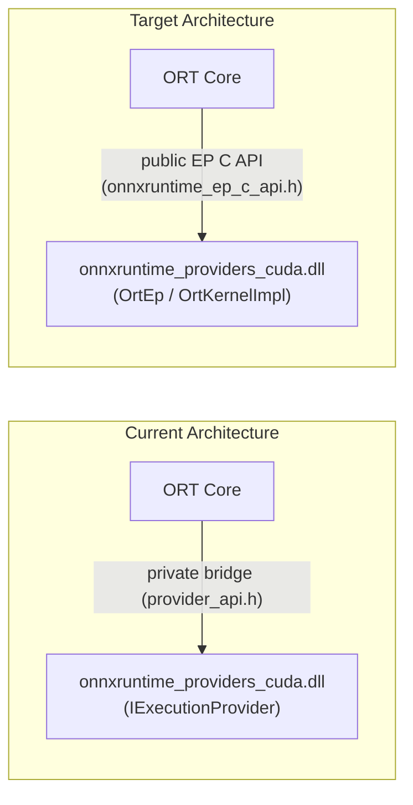
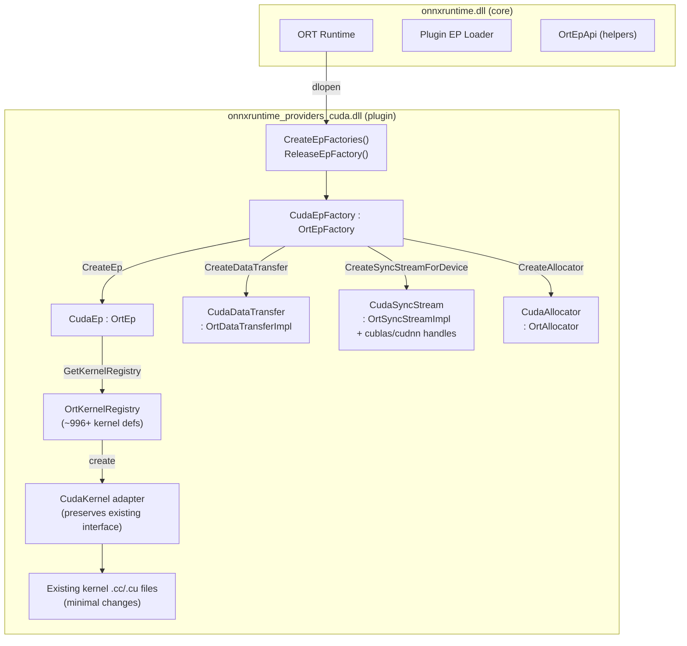

# CUDA EP Plugin Migration — Design & Task Breakdown

## 1. Executive Summary

Migrate the CUDA Execution Provider from an internally-linked EP to a **Plugin EP** using the public [onnxruntime_ep_c_api.h](file:///home/tlwu/onnxruntime/include/onnxruntime/core/session/onnxruntime_ep_c_api.h) interface.

### Key Principles

1. **Incremental migration** — Always keep the EP buildable and testable with existing CI. Un-ported parts continue using internal headers until migrated.
2. **Preserve kernel interface** — Keep the [CudaKernel](file:///home/tlwu/onnxruntime/onnxruntime/core/providers/cuda/cuda_kernel.h#18-209) base class interface similar enough that kernel porting can be largely scripted/automated.
3. **Design for CUDA Graph** — Defer CUDA Graph implementation but design the foundation (streams, EP lifecycle) to accommodate it.
4. **Out of scope** — NCCL/multi-GPU, training-specific features.

### Current State: Shared Library Bridge

> [!IMPORTANT]
> The CUDA EP is **already** a shared library (`onnxruntime_providers_cuda.dll/so`), but it uses a **private bridge API** ([provider_api.h](file:///home/tlwu/onnxruntime/onnxruntime/core/providers/shared_library/provider_api.h) → `ProviderHost_impl.h`) rather than the public EP C API. The migration replaces this private bridge with the public plugin EP interface.



### Scope

| Item | Size | Notes |
|------|------|-------|
| Standard op kernels | ~996 registrations | Interface-preserving port via script |
| Contrib op kernels | ~10+ domains, ~414 bert files | Same script-based approach |
| Stream/Data Transfer | ~5 files | Manual; maps to `OrtSyncStreamImpl`/`OrtDataTransferImpl` |
| Allocators | ~3 files | Maps to [OrtAllocator](file:///home/tlwu/onnxruntime/include/onnxruntime/core/session/onnxruntime_c_api.h#355-422) |
| Provider factory | ~2 files | New `OrtEpFactory`/`OrtEp` implementations |
| CUDA Graph | ~4 files | **Deferred** (design only in Phase 1) |
| cuBLAS/cuDNN handles | Per-thread context | Attach to stream impl |

---

## 2. Architecture

### 2.1 Target Plugin EP Structure



### 2.2 Kernel Interface Preservation Strategy

The key to minimizing per-kernel changes: create a [CudaKernel](file:///home/tlwu/onnxruntime/onnxruntime/core/providers/cuda/cuda_kernel.h#18-209) adapter that *looks identical* to the current class but is implemented on top of the public API.

```diff
 // Current: depends on IExecutionProvider, OpKernel, OpKernelContext
 class CudaKernel : public OpKernel {
   CUDAExecutionProvider* provider_;
   cudaStream_t Stream(OpKernelContext*);
   cublasHandle_t GetCublasHandle(OpKernelContext*);
   // ...
 };

+// Plugin: same interface, backed by OrtEp C API
+class CudaKernel {
+  const OrtEp* ep_;                    // from OrtKernelInfo
+  cudaStream_t Stream(OrtKernelContext*);   // via OrtSyncStreamImpl::GetHandle
+  cublasHandle_t GetCublasHandle(OrtKernelContext*); // via CudaSyncStream
+  // GetScratchBuffer, AllocateBufferOnCPUPinned, etc. — same signatures
+};
```

Existing kernel code calls like [Stream(ctx)](file:///home/tlwu/onnxruntime/onnxruntime/core/framework/plugin_ep_stream.h#39-82), [GetCublasHandle(ctx)](file:///home/tlwu/onnxruntime/onnxruntime/core/providers/cuda/cuda_kernel.h#93-96), `GetScratchBuffer<T>(n, stream)` continue to work unchanged. The adapter translates to public API under the hood.

### 2.3 CUDA Graph Design Consideration (Deferred)

CUDA Graph capture/replay will be driven by:
- `OrtEp::OnRunStart` / [OnRunEnd](file:///home/tlwu/onnxruntime/onnxruntime/core/framework/plugin_ep_stream.h#59-63) — track run count, initiate capture/replay
- `OrtRunOptions` config entries — `cuda_graph_annotation_id`, `enable_cuda_graph`
- `CudaSyncStream` — graph capture operates on the CUDA stream held in the stream impl
- EP-internal [CUDAGraphManager](file:///home/tlwu/onnxruntime/onnxruntime/core/providers/cuda/cuda_graph.h#33-54) — same class, stored in `CudaEp`

No new public API needed; the existing `OnRunStart`/[OnRunEnd](file:///home/tlwu/onnxruntime/onnxruntime/core/framework/plugin_ep_stream.h#59-63) + `SetDynamicOptions` + `OrtRunOptions` are sufficient.

---

## 3. Incremental Migration Stages

> [!TIP]
> Each stage produces a buildable, testable EP. Internal headers are allowed for un-ported parts. CI runs at every stage.

### Stage 1: Plugin Shell & Infrastructure

**Goal**: EP loads via plugin API, creates streams/allocators, runs [Memcpy](file:///home/tlwu/onnxruntime/onnxruntime/core/providers/cuda/cuda_execution_provider.cc#46-47) + simple ops.

| # | Work Item | Details |
|---|-----------|---------|
| 1.1 | DLL entry points | `CreateEpFactories()`, `ReleaseEpFactory()`, symbol exports ([.def](file:///home/tlwu/onnxruntime/onnxruntime/core/providers/cuda/symbols.def)/[.lds](file:///home/tlwu/onnxruntime/onnxruntime/core/providers/cuda/version_script.lds)) |
| 1.2 | `CudaEpFactory` | `GetName/Vendor/Version`, [GetSupportedDevices](file:///home/tlwu/onnxruntime/onnxruntime/core/session/plugin_ep/ep_factory_webgpu.cc#18-39) (CUDA device enumeration), `CreateEp`, `ReleaseEp`, `IsStreamAware` → true |
| 1.3 | `CudaEp` | `GetName`, `GetCapability` (kernel registry lookup), `GetKernelRegistry`, `OnRunStart`/[OnRunEnd](file:///home/tlwu/onnxruntime/onnxruntime/core/framework/plugin_ep_stream.h#59-63) (stub, design for CUDA Graph), `GetPreferredDataLayout` |
| 1.4 | `CudaAllocator : OrtAllocator` | Device allocator (`cudaMalloc`/`cudaFree`), pinned allocator (`cudaHostAlloc`/`cudaFreeHost`) |
| 1.5 | `CudaDataTransfer : OrtDataTransferImpl` | `CanCopy`, `CopyTensors` — port from [GPUDataTransfer](file:///home/tlwu/onnxruntime/onnxruntime/core/providers/cuda/gpu_data_transfer.h#11-23) |
| 1.6 | `CudaSyncStream : OrtSyncStreamImpl` | `GetHandle`, `Flush`, [CreateNotification](file:///home/tlwu/onnxruntime/onnxruntime/core/framework/plugin_ep_stream.h#45-56), `OnSessionRunEnd`. Attach cuBLAS/cuDNN handles. |
| 1.7 | `CudaSyncNotification : OrtSyncNotificationImpl` | `Activate`, `WaitOnDevice`, `WaitOnHost` via CUDA events |
| 1.8 | Provider options | Parse [CUDAExecutionProviderInfo](file:///home/tlwu/onnxruntime/onnxruntime/core/providers/cuda/cuda_provider_factory.cc#164-167) from `OrtSessionOptions` |
| 1.9 | [CudaKernel](file:///home/tlwu/onnxruntime/onnxruntime/core/providers/cuda/cuda_kernel.h#18-209) adapter | Create plugin-API-backed [CudaKernel](file:///home/tlwu/onnxruntime/onnxruntime/core/providers/cuda/cuda_kernel.h#18-209) base class preserving existing interface |
| 1.10 | CMake integration | Dual-mode build: existing static-link + new plugin mode behind `BUILD_CUDA_EP_AS_PLUGIN` flag |
| 1.11 | Internal adapter | `ep_factory_cuda.cc` for static-link mode (like [ep_factory_webgpu.cc](file:///home/tlwu/onnxruntime/onnxruntime/core/session/plugin_ep/ep_factory_webgpu.cc)) |
| 1.12 | Validate | Run basic ops (Memcpy, Relu, Add) through plugin EP. CI green. |

**Un-ported items using internal headers**: All kernel registrations and kernel implementations still go through existing [provider_api.h](file:///home/tlwu/onnxruntime/onnxruntime/core/providers/shared_library/provider_api.h) bridge. Only the EP shell uses the new public API.

---

### Stage 2: Kernel Registration Migration

**Goal**: Port kernel registration to `OrtKernelRegistry` without changing kernel implementations.

| # | Work Item | Details |
|---|-----------|---------|
| 2.1 | Registration migration script | Script that parses `ONNX_OPERATOR_KERNEL_EX` / `BuildKernelCreateInfo` macros and generates equivalent `OrtKernelDefBuilder` + `OrtKernelRegistry_AddKernel` code |
| 2.2 | Standard op registrations | Apply script to [cuda_execution_provider.cc](file:///home/tlwu/onnxruntime/onnxruntime/core/providers/cuda/cuda_execution_provider.cc) (~996 entries) |
| 2.3 | NHWC registrations | Port [cuda_nhwc_kernels.cc](file:///home/tlwu/onnxruntime/onnxruntime/core/providers/cuda/cuda_nhwc_kernels.cc) registrations |
| 2.4 | Contrib op registrations | Port [cuda_contrib_kernels.cc](file:///home/tlwu/onnxruntime/onnxruntime/contrib_ops/cuda/cuda_contrib_kernels.cc). Register custom op domains via `OrtEpFactory::GetCustomOpDomains`. |
| 2.5 | Validate | All kernels register correctly. CI green with both static and plugin modes. |

**Key insight**: The `OrtKernelImpl` wraps the existing kernel creates. Each kernel class still inherits [CudaKernel](file:///home/tlwu/onnxruntime/onnxruntime/core/providers/cuda/cuda_kernel.h#18-209) (the adapter from 1.9). The registration just switches from internal `KernelDefBuilder` to `OrtKernelDefBuilder`.

---

### Stage 3: Kernel Adapter Completion

**Goal**: Replace internal kernel runtime dependencies with public API equivalents.

| # | Work Item | Details |
|---|-----------|---------|
| 3.1 | `OpKernelContext` → `OrtKernelContext` | Adapter: `GetInput`/`GetOutput` → `OrtApi::KernelContext_Get*`. Mostly in [CudaKernel](file:///home/tlwu/onnxruntime/onnxruntime/core/providers/cuda/cuda_kernel.h#18-209) adapter. |
| 3.2 | [Tensor](file:///home/tlwu/onnxruntime/onnxruntime/core/providers/cuda/cuda_kernel.h#193-197) → `OrtValue` | Adapter: shape, data pointer, element type via public API. Create thin `TensorRef` wrapper. |
| 3.3 | `OpKernelInfo` → `OrtKernelInfo` | Adapter: `GetAttr<>` → `KernelInfoGetAttribute*` |
| 3.4 | `IAllocator` → [OrtAllocator](file:///home/tlwu/onnxruntime/include/onnxruntime/core/session/onnxruntime_c_api.h#355-422) | [GetScratchBuffer](file:///home/tlwu/onnxruntime/onnxruntime/core/providers/cuda/cuda_kernel.h#42-51), [AllocateBufferOnCPUPinned](file:///home/tlwu/onnxruntime/onnxruntime/core/providers/cuda/cuda_kernel.h#68-73) via public allocator API |
| 3.5 | `DataTransferManager` → direct CUDA calls | [CopyTensor](file:///home/tlwu/onnxruntime/onnxruntime/core/providers/cuda/cuda_kernel.h#193-197) in base class uses CUDA memcpy directly (no internal DT manager needed) |
| 3.6 | Remove [provider_api.h](file:///home/tlwu/onnxruntime/onnxruntime/core/providers/shared_library/provider_api.h) includes | File-by-file removal as dependencies are replaced. Track with a counter. |
| 3.7 | Validate | Run full CUDA op test suite. CI green. |

---

### Stage 4: Remove Private Bridge

**Goal**: Sever all [provider_api.h](file:///home/tlwu/onnxruntime/onnxruntime/core/providers/shared_library/provider_api.h) / `ProviderHost_impl.h` dependencies. Fully standalone DLL.

| # | Work Item | Details |
|---|-----------|---------|
| 4.1 | Audit remaining internal includes | Grep for internal header usage, create hit list |
| 4.2 | Port remaining dependencies | Case-by-case: ONNX proto types (use public API), logging (use `OrtLogger`), etc. |
| 4.3 | Remove `ProviderHost_impl.h` bridge for CUDA | Remove CUDA entries from the provider host bridge |
| 4.4 | Compile-only mode validation | Build with `BUILD_CUDA_EP_AS_PLUGIN=ON` and verify no internal headers included |
| 4.5 | Validate | Full CI suite with plugin-only CUDA EP |

---

### Stage 5: Advanced Features & Polish

**Goal**: CUDA Graph, profiling, perf validation, packaging.

| # | Work Item | Details |
|---|-----------|---------|
| 5.1 | CUDA Graph implementation | Port [CUDAGraph](file:///home/tlwu/onnxruntime/onnxruntime/core/providers/cuda/cuda_graph.h#33-54)/[CUDAGraphManager](file:///home/tlwu/onnxruntime/onnxruntime/core/providers/cuda/cuda_graph.h#33-54) into plugin EP. Drive via `OnRunStart`/[OnRunEnd](file:///home/tlwu/onnxruntime/onnxruntime/core/framework/plugin_ep_stream.h#59-63). |
| 5.2 | NVTX profiling | Use NVTX directly (no internal profiler API needed) |
| 5.3 | Tunable ops | Evaluate need; may defer if public API gap exists |
| 5.4 | External resource import | `OrtExternalResourceImporterImpl` for CUDA memory/semaphore import |
| 5.5 | Performance regression testing | Benchmark plugin vs static-link across model zoo |
| 5.6 | Python packaging | `onnxruntime-gpu` pip package includes plugin DLL |
| 5.7 | CI pipeline | Dedicated CI jobs for plugin mode |

---

## 4. Kernel Porting Script Design

The registration migration script (Stage 2.1) automates the bulk of kernel porting:

### Input Pattern (existing)
```cpp
// Registration macro
ONNX_OPERATOR_KERNEL_EX(
    Relu, kOnnxDomain, 14, kCudaExecutionProvider,
    (*KernelDefBuilder::Create())
        .TypeConstraint("T", DataTypeImpl::AllIEEEFloatTensorTypes()),
    Relu<float>);

// BuildKernelCreateInfo entry
BuildKernelCreateInfo<ONNX_OPERATOR_KERNEL_CLASS_NAME(kCudaExecutionProvider, kOnnxDomain, 14, Relu)>,
```

### Output Pattern (plugin)
```cpp
// OrtKernelDef creation
{
  auto builder = Ort::KernelDefBuilder()
      .SetOperatorType("Relu").SetDomain("")
      .SetSinceVersion(14, 14)
      .SetExecutionProvider("CUDAExecutionProvider")
      .AddTypeConstraint("T", ieee_float_types);
  auto kernel_def = builder.Build();
  ep_api.KernelRegistry_AddKernel(registry, kernel_def, ReluKernelCreateFn, nullptr);
}
```

### What the Script Does
1. Parse existing `ONNX_OPERATOR_KERNEL_EX` / `ONNX_OPERATOR_TYPED_KERNEL_EX` macros
2. Extract: op name, domain, version range, EP name, type constraints, input/output memory types
3. Generate `OrtKernelDefBuilder` code
4. Generate `OrtKernelCreateFunc` wrapper that creates the existing kernel class
5. The kernel class itself is **unchanged** — it still inherits [CudaKernel](file:///home/tlwu/onnxruntime/onnxruntime/core/providers/cuda/cuda_kernel.h#18-209) (the adapter)

---

## 5. Key Technical Challenges

### 5.1 Preserving [CudaKernel](file:///home/tlwu/onnxruntime/onnxruntime/core/providers/cuda/cuda_kernel.h#18-209) Interface

The [CudaKernel](file:///home/tlwu/onnxruntime/onnxruntime/core/providers/cuda/cuda_kernel.h#18-209) class exposes ~15 methods that kernels rely on. The adapter must provide identical signatures:

| Method | Current impl | Plugin adapter impl |
|--------|-------------|-------------------|
| [Stream(ctx)](file:///home/tlwu/onnxruntime/onnxruntime/core/framework/plugin_ep_stream.h#39-82) | `ctx->GetComputeStream()->GetHandle()` | `KernelContext_GetStream` → `OrtSyncStreamImpl::GetHandle` |
| [GetCublasHandle(ctx)](file:///home/tlwu/onnxruntime/onnxruntime/core/providers/cuda/cuda_kernel.h#93-96) | `stream->cublas_handle_` | `CudaSyncStream::cublas_handle_` |
| [GetCudnnHandle(ctx)](file:///home/tlwu/onnxruntime/onnxruntime/core/providers/cuda/cuda_kernel.h#81-84) | `stream->cudnn_handle_` | `CudaSyncStream::cudnn_handle_` |
| `GetScratchBuffer<T>(n, stream)` | `IAllocator::MakeUniquePtr` | [OrtAllocator](file:///home/tlwu/onnxruntime/include/onnxruntime/core/session/onnxruntime_c_api.h#355-422) → `cudaMalloc` |
| `GetDeviceProp()` | `provider_->GetDeviceProp()` | `CudaEp::device_prop_` |
| [UseTF32()](file:///home/tlwu/onnxruntime/onnxruntime/core/providers/cuda/cuda_kernel.h#97-100) | `provider_->UseTF32()` | `CudaEp::use_tf32_` |
| `GetConstOnes<T>(n, stream)` | `provider_->GetConstOnes` | `CudaEp::GetConstOnes` (same logic) |
| [AddDeferredReleaseCPUPtr](file:///home/tlwu/onnxruntime/onnxruntime/core/providers/cuda/cuda_kernel.h#62-67) | `CudaStream::EnqueDeferredCPUBuffer` | `CudaSyncStream::EnqueDeferredCPUBuffer` |

### 5.2 `GetCpuPreferredNodes`

Currently `IExecutionProvider::GetCpuPreferredNodes` is overridden. In the plugin API:
- `GetCapability` skips nodes that should stay on CPU
- `KernelDefBuilder_SetInputMemType(i, OrtMemTypeCPUInput)` marks specific inputs as CPU-preferred
- The existing logic in [cuda_execution_provider.cc](file:///home/tlwu/onnxruntime/onnxruntime/core/providers/cuda/cuda_execution_provider.cc) around `GetCpuPreferredNodes` maps to `GetCapability` filtering

### 5.3 Shared Library Protobuf Isolation

The CUDA EP currently uses re-declared ONNX protobuf types via [provider_api.h](file:///home/tlwu/onnxruntime/onnxruntime/core/providers/shared_library/provider_api.h). The plugin EP must avoid any protobuf dependency:
- Kernel attributes → `OrtKernelInfo::GetAttribute*`
- Tensor shapes → `OrtValue` API
- Graph access → `OrtGraph` API in `GetCapability`

---

## 6. Public API Gaps

| Gap | Impact | Mitigation |
|-----|--------|-----------|
| **Tuning context** | TunableOp can't tune | Defer; use default paths |
| **Profiler hook** | `EpProfiler` internal | Use NVTX directly |
| **Stream resources** | `CudaStream::GetResource()` internal | Handle lookup via `CudaSyncStream` casting |
| **ConstOnes buffer** | Shared GPU constant buffer | Manage in `CudaEp` instance |

---

## 7. Timeline

| Stage | Duration | CI Gate |
|-------|----------|---------|
| Stage 1: Plugin Shell | 1 weeks | Basic ops pass |
| Stage 2: Kernel Registration | 1 weeks | All kernels registered, existing tests pass |
| Stage 3: Kernel Adapter | 1 weeks | Full op test suite passes |
| Stage 4: Remove Bridge | 2 weeks | Standalone DLL compiles and passes CI |
| Stage 5: Advanced & Polish | 3 weeks | CUDA Graph, perf, packaging |
| **Total** | **~8 weeks** | |
